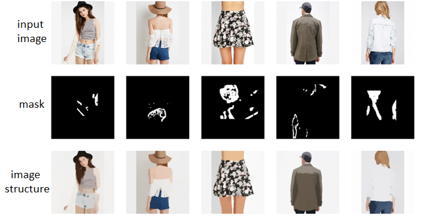
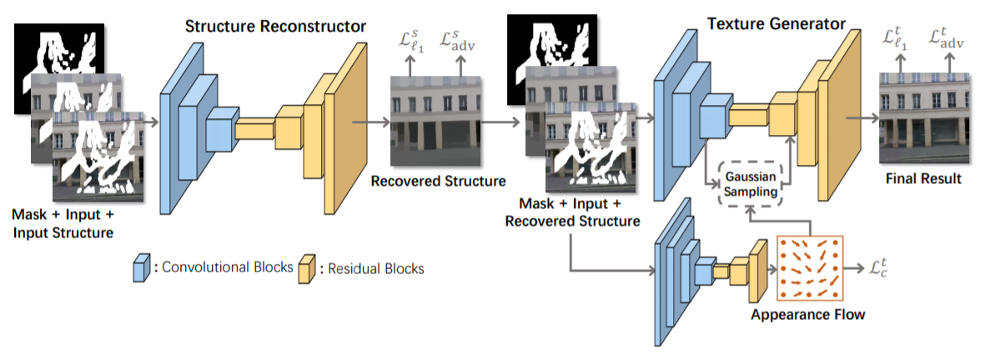
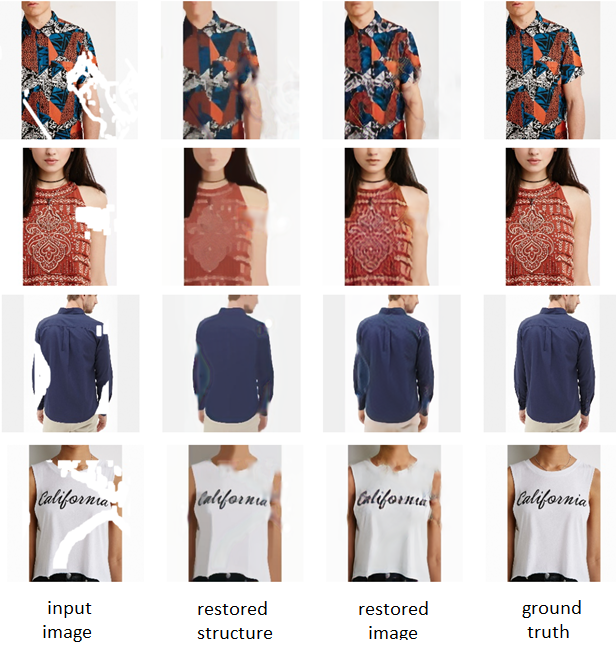

# TechnoTrack_Project
Реализация статьи StructureFlow: Image Inpainting via Structure-aware Appearance Flow за авторством Yurui Ren et. al.
Image inpainting с использованием 2 GANs и optical flow.

## Входные данные

Работаем со следующими сущностями:
* входящее изображение
* битовая маска, наносящая повреждение
* структура изображения

Структура изображений была получена с помощью RTV ("Structure extraction from texture via relative total variation" by Li Xu et al.)

## Структура сети

  

Первая часть сети, состоящая из одного GAN тренируется на то, чтобы из поврежденной структуры изображения восстанавливать структуру без повреждений.
Ей на вход подается изображение, измененное после наложения и пропущенное через RTV.

На выходе первой части у нас есть:
* поврежденное изображение с высокоуровневыми фичами
* битовая маска
* восстановленная структура изображения

Во второй части сети используется второй GAN для восстановления уже высокоуровневых деталей изображения. Кроме того, чтобы упростить этот процесс используется optical flow.
Optical flow помогает определить движение пикселей внутри картинки. В данной работе он используется чтобы понять, откуда следует взять неповрежденные пиксели, чтобы перенести их на поврежденную часть. Так, если на картинке повреждено изображение глаза, но при этом второй глаз остался неповрежденным, то optical flow покажет, что мы можем взять пиксели неповрежденного глаза и использовать их для отрисовки поврежденного.

## Результаты

  

После получения изображения из GAN можно было вернуться к первоначальной картинке, добавив нарисованные сетью части, что сделало бы итоговый результат более чётким. Однако, чтобы показать силу генеративной сети, мы решили оставить нетронутым её выходное изображение. Таким образом, сеть рисовала не недостающие части, а всю картинку. 
